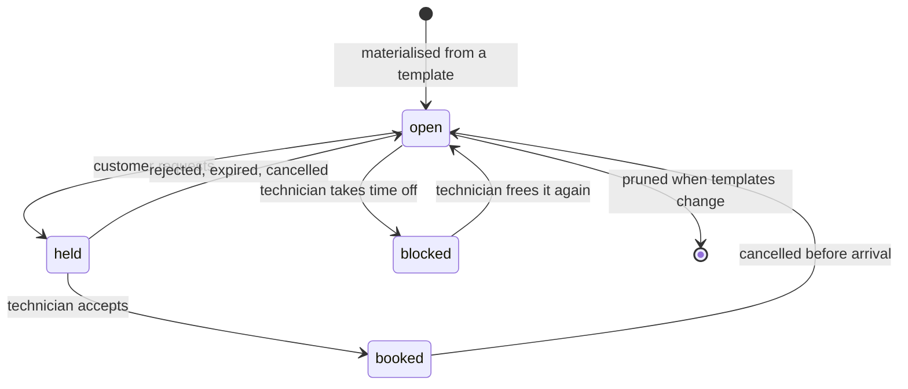
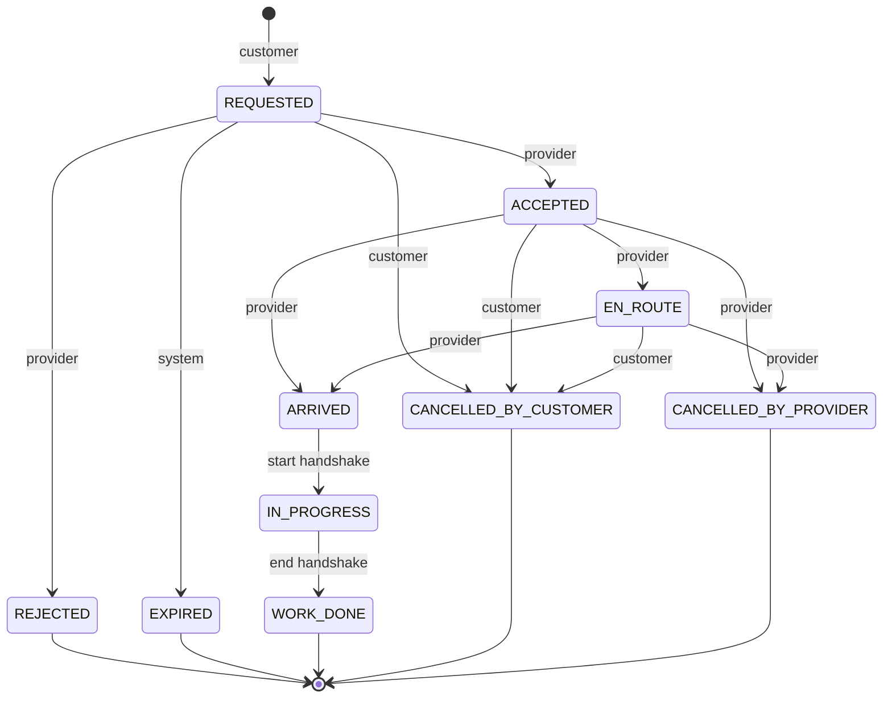

# Bookings and slots

Phase 6. How a customer's request becomes a technician standing at their door,
and what stops two customers being sent the same hour.

Related notes: [verification.md](./verification.md) (the state machine this one
copies), [search.md](./search.md) (where availability is read),
[geo-notes.md](./geo-notes.md).

---

## The one invariant

> **A technician can be committed to exactly one job at any instant.**

Everything else in this phase is arrangement. That sentence is enforced by a
single line of DDL:

```sql
ALTER TABLE slots
  ADD CONSTRAINT slots_no_double_booking
  EXCLUDE USING gist (provider_id WITH =, time_range WITH &&)
  WHERE (status IN ('held', 'booked'));
```

Postgres refuses the write. Not the service, not a lock, not a check in
TypeScript — the database. Application code can have a race; a constraint cannot.

Two details in that statement earn their place:

- **`WHERE (status IN ('held','booked'))`.** Open slots may overlap freely, which
  is what makes template regeneration possible: a new plan can be written
  alongside the old one without a conflict. Only committed time is exclusive.
- **`provider_id WITH =`.** The constraint is per technician. Two people working
  at 3pm on Thursday is two jobs, not a conflict — which is why the migration
  needs `btree_gist` (equality on a `uuid` inside a GiST index).

`time_range` is a generated `tstzrange` kept in step by a `BEFORE INSERT OR
UPDATE` trigger. It is never written by hand, and a test asserts it always equals
`tstzrange(starts_at, ends_at, '[)')`. The half-open bound matters: a slot ending
at 10:00 and one starting at 10:00 do **not** overlap.

Everything above the constraint — the Redis lock in `createBooking`, the
`status = 'open'` guard on the claim — is there to turn the common race into a
fast, friendly 409 instead of a constraint violation. None of it is the
guarantee. A test fires eight parallel bookings at one slot and asserts exactly
one 201 and seven 409s, with nothing falling through as a 500.

---

## Slot lifecycle

Availability is stored twice, deliberately.

- **Templates** (`provider_availability_templates`, Phase 3) are the intent:
  "Tuesdays, 18:00–22:00". Weekly, timezone-free, small.
- **Slots** (`slots`) are the commitment: a concrete hour on a concrete date that
  can be claimed, blocked, and constrained.



`blocked` exists so a technician can take an afternoon off without deleting the
template that describes their normal week.

### Materialisation

`planSlots` (in `modules/bookings/slot-plan.ts`) is pure and has no database
access, so every edge of the calendar arithmetic is unit-tested. Rules:

- **Everything is Asia/Kolkata**, at a fixed +05:30 with no DST. India's one
  mercy in timekeeping: plain arithmetic is exactly right and no tz database is
  needed. `istMidnightUtc`, `istDayParts` and `istDayOfWeek` do the conversion.
- **A window shorter than the increment produces nothing**, and so does the
  remainder at the end of a longer one. A 90-minute window at 60-minute
  increments yields one slot, not one-and-a-half. Offering a customer half an
  hour the technician never offered is worse than offering less.
- Output is sorted and deterministic, so a rerun is byte-identical.

### Regeneration

`reconcileSlots` diffs the plan against what exists. The rule that matters:

> **`held`, `booked` and `blocked` slots are never touched.**

Only `open` slots are added or removed. A technician editing their hours must not
cancel a job somebody already booked, and must not silently reopen time they
deliberately blocked. That makes the nightly `slot-horizon` job idempotent by
comparison rather than by bookkeeping — it simply re-runs.

The horizon is `SLOT_HORIZON_DAYS` (14 by default) and the increment is
`SLOT_INCREMENT_MINUTES` (60).

---

## Booking states



**Nothing cancels after ARRIVED.** Once a technician is standing at the door, "I
changed my mind" is a dispute, not a cancellation — letting either side cancel
there would erase a visit that actually happened. Disputes are Phase 9.

Two events are recorded without moving the booking: `otp_failed` and
`otp_locked`. A mistyped handshake code is evidence a dispute may need, but it is
not a state change.

**Ops appear in no transition rule.** Intervention is Phase 11, and allowing it
silently now would make an ops action indistinguishable from a technician's.

### The log is the truth

Same discipline as verification. `booking_events` is append-only — a trigger
refuses `UPDATE` unconditionally and `DELETE` unless the erasure path announces
itself with `SET LOCAL "fixbridge.allow_kyc_purge"`. `bookings.status` is a
cached projection, and every transition **reprojects from the log before
deciding**. If the two ever disagree, the log wins.

`projectBookingStatus` throws on a log it cannot replay. If that fires on real
data, something wrote around the state machine, and failing loudly beats quietly
reporting a status nobody can account for.

The transition table is **data**, not a switch statement:

```ts
{ from: 'ACCEPTED', event: 'en_route', to: 'EN_ROUTE', actors: ['provider'] }
```

Phases 8 and 9 extend this machine. Adding a row is something a reviewer can
check; finding every `case` in a service is not.

---

## The physical handshake

Two four-digit codes per booking, proving different things.

```mermaid
sequenceDiagram
    participant C as Customer
    participant A as API
    participant R as Redis
    participant T as Technician

    T->>A: POST /bookings/:id/accept
    A->>R: issue start + end codes (hashed + plaintext, TTL)
    A-->>T: ACCEPTED

    C->>A: GET /bookings/:id
    A->>R: peek start code
    A-->>C: startOtp (customer only)

    Note over C,T: technician arrives; customer reads the code aloud

    T->>A: POST /bookings/:id/start { otp }
    A->>R: check start
    A->>A: append arrived, then work_started
    A-->>T: IN_PROGRESS

    C->>A: GET /bookings/:id
    A-->>C: endOtp (only now)

    Note over C,T: work finishes; customer reads the second code

    T->>A: POST /bookings/:id/complete { otp }
    A-->>T: WORK_DONE
```

- **start** proves the technician is physically there. Only someone at the door
  can hear the customer read it out.
- **end** is the customer's sign-off. Without it, "he said it was finished" is
  one person's word.

**Four digits, not six.** These are spoken aloud, in person, often over the noise
of a job. The threat model is different from a login OTP — an attacker would have
to be standing there — and the attempt limit does the work that length does
elsewhere.

**The end code is not revealed until `IN_PROGRESS`.** Showing it at acceptance
would let it be handed over before anything had been done.

**Storage is Redis only, never Postgres** — the same rule as auth OTPs. One
deliberate difference: the plaintext _is_ stored, under a separate key, because
the customer must be shown their own code inside the app. There is nobody to send
it to, and the whole mechanism depends on them being able to read it out. The
hash still guards verification, and both keys die with the booking. A test greps
`booking_events` to prove no code ever reaches a database column.

**Locked stays locked.** After `BOOKING_OTP_MAX_ATTEMPTS` (5) wrong codes, the
booking locks and the _correct_ code stops working too. A login OTP can simply be
re-requested; a handshake cannot, because the point is that a specific person is
at a specific door. Ops unlock it, which also means somebody looks at why five
attempts failed.

---

## Phone masking

| Status                   | Counterpart phone | Address (to the technician) |
| ------------------------ | ----------------- | --------------------------- |
| `REQUESTED`              | masked            | hidden                      |
| `ACCEPTED` … `WORK_DONE` | full              | shown                       |
| any terminal state       | masked            | hidden                      |

Before acceptance there is nothing to coordinate, and a rejected request should
not hand a stranger somebody's number. After it, both sides genuinely need to
call each other — a technician who cannot find the gate will phone, and
pretending otherwise just pushes them onto WhatsApp where we can see nothing.

The address on a booking is a **snapshot** taken at creation. The customer may
edit or delete the address afterwards; a technician standing outside needs the
address they were sent to, not the current one.

---

## The transactional outbox

The problem: "change the state, then publish an event" is two writes to two
systems, and there is no ordering of them that is safe. Publish first and a crash
leaves an event for something that never happened; publish second and a crash
leaves a state change nobody hears about.

So the event is written to a Postgres table **inside the same transaction as the
state change**. Either both exist or neither does. A separate dispatcher then
reads that table and delivers.

```
┌─────────────────── one transaction ───────────────────┐
│  booking row  +  booking_event row  +  slot claim     │
│                    +  outbox row                       │
└───────────────────────────────────────────────────────┘
                          │
                 dispatcher polls
                          ▼
        registry.handlersFor(topic) → handlers
                          │
              success → processed_at set
              failure → attempts++, exponential backoff
                        parked after OUTBOX_MAX_ATTEMPTS
```

`enqueueOutbox` requires a `Prisma.TransactionClient`, not the top-level client.
If it could be called outside a transaction the guarantee would be optional, and
an optional guarantee is not one.

### The cost

Delivery is **at-least-once, never exactly-once**: the dispatcher can crash
between calling a handler and marking the row processed. **Every consumer must be
idempotent.** That is not a caveat to work around — it is the deal.

The acceptance-rate projector shows the shape: it _recomputes from the log_
rather than incrementing a counter, so delivering the same event twice produces
exactly the same numbers.

### No broker

One Postgres table and a `setInterval` is the right size for pilot traffic.
Kafka, BullMQ and friends are all things that can be down at 2am, and none of
them would make the guarantee any stronger — the guarantee comes from the
transaction, not the transport.

A failed row is **parked, not dropped**: after `OUTBOX_MAX_ATTEMPTS` it stops
being retried but the row stays, with `last_error`, for Phase 11's ops view.

### Topics

The contract other modules subscribe to. Renaming one silently breaks a consumer.

| Topic                           | Emitted when                          |
| ------------------------------- | ------------------------------------- |
| `booking.requested`             | a customer books a slot               |
| `booking.accepted`              | a technician accepts                  |
| `booking.rejected`              | a technician declines                 |
| `booking.expired`               | nobody answered in time               |
| `booking.en_route`              | a technician sets off                 |
| `booking.arrived`               | the start handshake succeeds          |
| `booking.work_started`          | work begins                           |
| `booking.work_done`             | the end handshake succeeds            |
| `booking.cancelled_by_customer` | a customer cancels                    |
| `booking.cancelled_by_provider` | a technician abandons an accepted job |
| `booking.otp_failed`            | a wrong handshake code                |
| `booking.otp_locked`            | too many wrong codes                  |

### How later phases subscribe

```ts
// In a module's own registration function, called at boot.
export function registerNotificationHandlers(registry: OutboxRegistry, ctx: AppContext): void {
  registry.subscribe(BOOKING_TOPICS.accepted, async (event) => {
    // Idempotent. This will be called more than once.
    await sendWhatsApp(ctx, event.aggregateId, 'booking.accepted');
  });
}
```

Wire it in `core/background.ts` alongside `registerAcceptanceRateProjector`. A
topic nobody listens to is normal, not an error — this phase already emits topics
Phases 9 and 10 will take up.

- **Phase 9 (trust & disputes)** reads `rejected`, `expired`,
  `cancelled_by_provider` and `otp_locked` — the reliability signals — and the
  reason codes in each payload.
- **Phase 10 (notifications)** subscribes to essentially all of them, and sends
  over the WhatsApp Business API.

---

## Acceptance rate

`accepted / (accepted + rejected + expired)`, over a rolling 30 days.

Ignoring a request counts against a technician exactly as much as declining it:
from the customer's side, silence and "no" are the same wasted wait. If anything
silence is worse.

Provider cancellations are counted separately and **excluded** from the ratio —
abandoning an accepted job is a different, more serious failure, and Phase 9 will
weigh it on its own rather than diluting it into this number.

**Below 5 decided requests the rate is `null`, not a number.** One rejection out
of two is 50%, which would bury a technician who joined last week under everyone
with a longer record. Small samples say nothing, and pretending they do would
make the ranking actively unfair to new supply — the exact people a young
marketplace needs. `null` falls back to the neutral 0.5 in the ranking, so a
newcomer sits mid-pack rather than at the bottom.

This closes the neutral default Phase 5 documented in
[search.md](./search.md#ranking).

---

## Background jobs

In-process, Redis-locked, both idempotent. No external scheduler: at pilot scale
a `setInterval` with a lock is the whole requirement, and every additional moving
part is something that can be down at 2am.

| Job               | Interval                                 | What it does                                                                     |
| ----------------- | ---------------------------------------- | -------------------------------------------------------------------------------- |
| `booking-expiry`  | `BOOKING_EXPIRY_JOB_INTERVAL_MS` (1 min) | Expires requests older than `BOOKING_REQUEST_TTL_MINUTES`, releasing their slots |
| `slot-horizon`    | `SLOT_HORIZON_JOB_INTERVAL_MS` (6 h)     | Extends every listed technician's slots to the horizon                           |
| outbox dispatcher | `OUTBOX_POLL_INTERVAL_MS` (2 s)          | Delivers pending events                                                          |

The lock means several API instances can run the same job and only one does the
work. It can also **expire mid-run under load**, so every job must be idempotent
regardless — a job that only behaves when it runs exactly once is a job that will
misbehave.

`slot-horizon` runs once at boot as well as on its interval. A service that
restarts more often than the interval would otherwise never materialise a slot,
and "nobody can be booked" is a silent failure rather than a loud one.

All of it is gated on `JOBS_ENABLED`, which is off in tests — the suite drives
the jobs directly with an injected clock rather than waiting for a timer.

---

## Invariants

Things that must stay true. Each has a test.

1. A technician holds at most one `held`/`booked` slot per instant. _(exclusion
   constraint; proved at SQL level and under 8-way parallel load)_
2. A `held` or `booked` slot always references a booking; an `open` or `blocked`
   one never does. _(`slots_booking_link_check`)_
3. `time_range` always equals `tstzrange(starts_at, ends_at, '[)')`. _(trigger)_
4. Regenerating slots never deletes or reopens a `held`, `booked` or `blocked`
   slot. _(`reconcileSlots`)_
5. A booking's status always equals the projection of its event log. _(every
   transition reprojects first)_
6. `booking_events` rows are never updated, and never deleted outside the erasure
   path. _(trigger)_
7. Nothing transitions out of a terminal status. _(state machine)_
8. Nothing cancels from `ARRIVED` onwards. _(state machine)_
9. Handshake codes never reach Postgres. _(Redis-only store; grep test)_
10. An outbox row exists if and only if its state change committed. _(same
    transaction)_
11. Phone numbers are masked outside `ACCEPTED`…`WORK_DONE`.
12. Search never returns a technician whose hour is already taken.

---

## What is deliberately not here

- **Payments.** `visit_fee_paise` is snapshotted onto every booking and charged
  by nobody. Phase 8.
- **Rescheduling.** v1 has no reschedule: it is cancel plus rebook. The
  `rescheduled_from_booking_id` column exists so the two can be linked for
  analytics when that changes.
- **Notifications.** Every transition emits an outbox event and nothing consumes
  most of them yet. Phase 10 delivers over WhatsApp.
- **Ops intervention.** No ops actor appears in any transition rule. Phase 11.
- **Trust scoring.** Acceptance rate is one input; the composite score is Phase 9.
