# Money

Phase 8. How payments are collected, recorded, refunded and paid out.

Related notes: [bookings.md](./bookings.md) (where `payable_paise` is frozen),
[API.md](./API.md).

---

## The two laws

> **1. Money exists only as double-entry ledger rows.**
> There is no balance column anywhere and there never will be. Balances are SQL
> views that sum `ledger_entries`. Every journal must balance — enforced by a
> deferred constraint trigger, not by the code that writes it.

> **2. The gateway webhook is the only source of payment truth.**
> A browser callback may optimistically show success. It never records it.

Everything below is a consequence of those two sentences.

### Why no balance column

A balance you can `UPDATE` is a balance that can be wrong, and the moment one
exists, every code path that touches money has to remember to keep it right —
including the one somebody adds next year without reading this file. Summing the
entries cannot drift, explains itself, and turns "why is this number what it is"
into a query rather than an investigation.

The cost is a `GROUP BY` on every read. At pilot volume that is nothing, and when
it stops being nothing the answer is a materialised view over the same entries,
not a column somebody can set.

### Why the webhook and not the callback

The callback comes from a browser. It can be forged, replayed, or — far more
often — simply never arrive, because the customer's UPI app said "success" and
they locked their phone. The webhook is server-to-server, signed, and retried
until we acknowledge it.

So `POST /payments/:id/checkout-callback` verifies the signature, stamps
`checkout_verified_at`, and moves **nothing**. It exists so a screen can honestly
say "payment received, confirming…" and so support can tell the difference
between "the customer says they paid" and "the client holds a signed receipt".

There is a mandatory test for the case that matters: **the browser closed after
paying**. No callback ever fires, and the booking settles anyway.

---

## Accounts

Five account types carry the whole pilot. Rows are created lazily, so a
technician who has never been paid has no account rather than a row of zeroes.

| Account            | Kind      | Meaning                                         | Balance          |
| ------------------ | --------- | ----------------------------------------------- | ---------------- |
| `gateway_cash`     | asset     | Platform money sitting at the gateway           | debits − credits |
| `provider_payable` | liability | What we owe a technician                        | credits − debits |
| `provider_dues`    | asset     | What a technician owes us, from cash commission | debits − credits |
| `platform_revenue` | revenue   | Our cut                                         | credits − debits |
| `refunds_payable`  | liability | Refunds owed but not yet settled                | credits − debits |

An account is `(account_type, owner_type, owner_id)`, unique with
`NULLS NOT DISTINCT` — platform accounts have a NULL owner, and under the
ordinary rule two NULLs are different, which would let a second
`platform_revenue` account exist and silently split our income across both.

`provider_payable` and `provider_dues` are the two sides of one relationship and
are deliberately kept apart. A wallet showing "we owe you ₹4,000, you owe us
₹600" is checkable against a technician's own week. "₹3,400" is not.

### Views

- **`account_balances`** — every account, signed so a positive number always
  means "this account holds value", whichever side of the books it lives on.
- **`provider_balances`** — `payable`, `dues`, and `net = payable − dues` per
  technician.
- **`platform_revenue_view`** — cash held, owed out, owed in, revenue, refunds
  pending.

The accounting identity that must always hold, and has a test:

```
gateway_cash = owed_to_providers + revenue − owed_by_providers
```

---

## Journal shapes

Every flow, exactly. All of these balance by construction: the two halves of a
commission split come from one subtraction, so they cannot fail to add back up.

### Online capture

```
debit   gateway_cash        gross            the platform now holds it
credit  provider_payable    gross − cut      we owe the technician
credit  platform_revenue    cut              our share
```

### Cash collected

```
debit   provider_dues       cut              they hold our money, so they owe us
credit  platform_revenue    cut              it is still our revenue
```

**Only the commission moves.** The rest went from the customer's hand into the
technician's and never touched the platform; posting the gross here would put
cash on our balance sheet that we do not have. That asymmetry between the rails
is the single most important thing in this document after the two laws.

### Refund (one journal, not two)

```
debit   provider_payable    refund − cut     they give back their share
debit   platform_revenue    cut              we give back ours
credit  gateway_cash        refund           it leaves our balance at the gateway
```

Collapsed into one journal rather than routing through `refunds_payable`. With
this gateway the money leaves our balance the moment the refund is processed, so
a `refunds_payable` leg would be credited and debited in the same breath and
would describe a state that never exists. The account is kept for a gateway that
settles differently.

**The technician bears their share.** Refunding out of platform revenue alone
would quietly turn every refund into a subsidy we pay a technician for work the
customer rejected.

### Payout

```
debit   provider_payable    amount           we no longer owe it
credit  gateway_cash        amount           it left our account
```

### Dues settled

```
debit   gateway_cash        amount           their transfer reached us
credit  provider_dues       amount           the debt is cleared
```

---

## Commission

Basis points, because percentages with decimal points are how rounding errors get
into money. 1200 = 12%.

Resolved **service → cluster → city → global**, the same chain as the visit fee
and through the same tested function (`core/scoped-config.ts`).

| Scope                         | Seeded rate              | Why                                               |
| ----------------------------- | ------------------------ | ------------------------------------------------- |
| Motors & Generators (cluster) | 1000 bps                 | Scarce, higher-ticket trades — 10% to keep supply |
| Jabalpur (city)               | 1200 bps                 | The baseline                                      |
| Global default                | `COMMISSION_DEFAULT_BPS` | A new city on its first day                       |

**Rounding goes down, always to the technician.** Over a year that is a handful
of rupees we forgo, and it makes "we never round in our own favour" true without
an asterisk — worth more than the rupees when a technician is checking their
wallet against a bill.

**The rate is snapshotted onto the payment at collection.** Changing the config
afterwards moves nothing that has already happened. A technician agreed to a rate
on the day they did the work; a repricing six weeks later cannot reach back.

The same rule already applied to the visit fee, and from Phase 8 it applies to
the **price card** too — `bookings.price_card_amount_paise` is copied at
creation, so a technician editing their rate mid-job cannot change that
customer's bill.

---

## Webhook idempotency

```
POST /api/v1/webhooks/razorpay
  ↓  verify HMAC over the exact bytes
  ↓  INSERT INTO webhook_events (gateway_event_id UNIQUE)  ← the wall
  ↓  enqueue outbox `webhook.received`  (same transaction)
  ↓  200 OK
        ↓  dispatcher, later
        ↓  processWebhookEvent → capture / fail / refund
```

**`webhook_events.gateway_event_id` is UNIQUE, and that one constraint is the
entire mechanism.** A gateway will deliver the same event more than once — on its
own retry schedule, and again whenever an operator hits "resend". The second
insert loses, no outbox row is written, and nothing runs twice. A test replays
one event three times and asserts a single journal.

We answer `200` either way. Telling a gateway "error" for something we already
handled only makes it retry harder.

Processing is **asynchronous** because a gateway gives you a few seconds before
it calls a delivery failed. A handler that posts ledger rows inside that budget
is a handler that will one day cause a retry storm at the worst possible moment.

The handlers are idempotent too — capture ignores a payment no longer `created`,
refund completion ignores one already `processed` — because our own outbox is
at-least-once and will call them twice eventually.

### The raw-body trap

The signature is over the **exact bytes** the gateway sent. `express.json()`
consumes the stream and hands back an object; re-serialising that object reorders
keys and normalises whitespace, so the HMAC over it does not match and _every_
webhook silently fails verification.

The fix is ordering. `express.raw()` is mounted on `/api/v1/webhooks` **before**
the JSON parser in `app.ts`, and a test posts a body with deliberately awkward
key order and whitespace that no re-serialisation would reproduce.

### Amount mismatch

If the gateway reports an amount that is not the frozen payable, the event is
**parked** — `processing_error` set, `processed_at` left null, nothing posted.
That means the gateway and our books disagree about what a customer owed, which
is either a bug or something worse, and the only safe response is to put it in
front of a person. Phase 11 lists parked events.

---

## Payout lifecycle

```mermaid
stateDiagram-v2
    [*] --> draft : daily job or ops, snapshots every positive balance
    draft --> processing : ops start making transfers
    processing --> completed : every line dealt with

    state "per payout" as p
    [*] --> pending
    pending --> paid : ops enters the UTR → ledger moves
    pending --> failed : transfer bounced; nothing posted
```



Pilot-grade and honest about it: a batch is a list of amounts, somebody makes the
transfers by hand, and they type the UTR back in. A RazorpayX integration is a
day's work whenever the volume justifies it; building it now would mean
maintaining an untested path against a real money API for months before anybody
uses it. The adapter interface is there when it is wanted.

What _is_ built properly is the accounting:

- A payout touches the ledger **only when it is marked paid**, so a drafted batch
  moves nothing and a failed transfer leaves the balance where it was.
- The UTR is required by a CHECK constraint. A payout marked paid with no bank
  reference is unauditable, and the one time anybody needs it is the one time a
  technician says they were not paid.
- A batch header that disagrees with its own lines cannot commit — a deferred
  trigger checks `total_paise` and `payout_count` against the payouts.

### Two exclusions

- **Below `PAYOUT_MINIMUM_PAISE`** (₹100): a ₹12 bank transfer costs more effort
  than it moves. The balance stays put and rolls into the next run.
- **Net negative**: a technician who has collected more cash commission than we
  owe them is skipped, and their dues are left exactly where they are. We do not
  net a debt out of a payout without them agreeing to it — the first time a
  technician sees a payout smaller than they expected is the last time they trust
  the wallet screen.

---

## The two rails, side by side

|                         | Online                  | Cash                      |
| ----------------------- | ----------------------- | ------------------------- |
| Who holds the money     | Us, at the gateway      | The technician            |
| What the ledger records | Gross, split three ways | Commission only           |
| Confirmed by            | Signed webhook          | The technician marking it |
| Technician ends up      | Owed `gross − cut`      | Owing us `cut`            |
| Refundable through us   | Yes                     | **No**                    |
| Customer told           | Yes (Phase 10)          | Yes — deliberately        |

**Cash is not refundable through us.** We never held that money; issuing a refund
from the ledger would mean paying out money we never received. A cash refund is a
conversation between two people with ops mediating.

**The customer is told when cash is marked.** Marking cash collected is the one
action a technician can take unilaterally about money, so it gets sunlight: the
customer sees "your technician recorded ₹X in cash" and can say otherwise.
Disputes are Phase 9; visibility is what makes them possible.

---

## Erasure and retention

Financial records are **not** personal data, carry statutory retention, and must
survive a DPDP erasure request. So:

- `ledger_journals.booking_id` and `payments.booking_id` are `ON DELETE SET NULL`.
  Erasure cuts the link to the human and leaves the money.
- Ledger rows have **no purge escape hatch at all** — unlike `booking_events` and
  `verification_events`, which allow DELETE under `fixbridge.allow_kyc_purge`.
- The immutability trigger permits exactly one kind of UPDATE: a `booking_id` or
  `payment_id` going to NULL. Re-pointing a journal at a _different_ booking is
  an audit trail being rewritten, and is refused.
- A correction is an `adjustment` journal. That is what double entry is for.

---

## Configuration

| Variable                  | Default | Notes                                   |
| ------------------------- | ------- | --------------------------------------- |
| `PAYMENT_GATEWAY`         | `fake`  | **Refused in production.**              |
| `RAZORPAY_KEY_ID`         | —       | Required when the gateway is `razorpay` |
| `RAZORPAY_KEY_SECRET`     | —       | Required. Never logged, never in code   |
| `RAZORPAY_WEBHOOK_SECRET` | —       | Required. Signs webhook bodies          |
| `COMMISSION_DEFAULT_BPS`  | `1200`  | Last rung of the resolution chain       |
| `COLLECT_FEE_AT_BOOKING`  | `false` | Built and tested; off for the pilot     |
| `PAYOUT_MINIMUM_PAISE`    | `10000` | ₹100                                    |

The config schema **refuses to parse** a production environment on the fake
gateway — the same shape of guard as the fixed-OTP one. A production build
accepting payments that never happened is the worst thing this codebase could
do, so it cannot start.

It also refuses `PAYMENT_GATEWAY=razorpay` with any key missing, in _every_
environment: a half-configured gateway fails at the first signature check, by
which point a customer has already paid.

**A repository-wide scan fails the build if a live key (`rzp_live_…`) ever lands
anywhere** in source, fixtures or docs. Test keys are fine — refusing those too
would only push people into obscuring them.

---

## Running against real Razorpay (test mode)

Everything in CI runs on the fake. To exercise the real adapter once, locally:

1. **Get test keys.** Razorpay Dashboard → _Settings → API Keys_ → Generate Test
   Key. You get `rzp_test_…` and a secret shown once.

2. **Put them in `apps/api/.env`** — never in a file that is committed:

   ```
   PAYMENT_GATEWAY=razorpay
   RAZORPAY_KEY_ID=rzp_test_xxxxxxxxxxxx
   RAZORPAY_KEY_SECRET=xxxxxxxxxxxxxxxx
   RAZORPAY_WEBHOOK_SECRET=pick-any-long-random-string
   ```

3. **Expose your local API.** Razorpay has to reach your machine:

   ```bash
   npx localtunnel --port 3000
   # or: ngrok http 3000
   ```

   Both print an HTTPS URL. Note it.

4. **Register the webhook.** Dashboard → _Settings → Webhooks → Add New Webhook_:

   - **URL**: `https://<your-tunnel>/api/v1/webhooks/razorpay`
   - **Secret**: the same string as `RAZORPAY_WEBHOOK_SECRET`
   - **Active events**: `payment.captured`, `payment.failed`, `refund.processed`,
     `refund.failed`

5. **Run it.** `npm run start:dev`, book and complete a job, start a payment, and
   pay with any [test card or test UPI id](https://razorpay.com/docs/payments/payments/test-card-details/).
   The webhook should arrive within a second or two; `webhook_events` will show
   it, and the ledger will show the journal.

If the signature is rejected, the secret in the dashboard and the one in `.env`
do not match — that is almost always what it is.

---

## What is deliberately not here

- **GST invoices and PDFs.** The breakdown data is sufficient for the pilot.
- **RazorpayX live payouts.** Interface only; transfers are manual.
- **Razorpay Route / split settlement.** Year two, when volume justifies the
  onboarding burden on every technician.
- **Customer wallets and credits.** A refund goes back to the source.
- **Subscriptions and AMC billing.** Post-pilot.
- **Payment links, EMI, card-specific flows.** UPI-first; whatever the checkout
  offers rides along free.
- **Chargebacks and disputes.** Phase 9's complaint flow plus ops.
- **Any admin UI.** Phase 11 — these are APIs.
