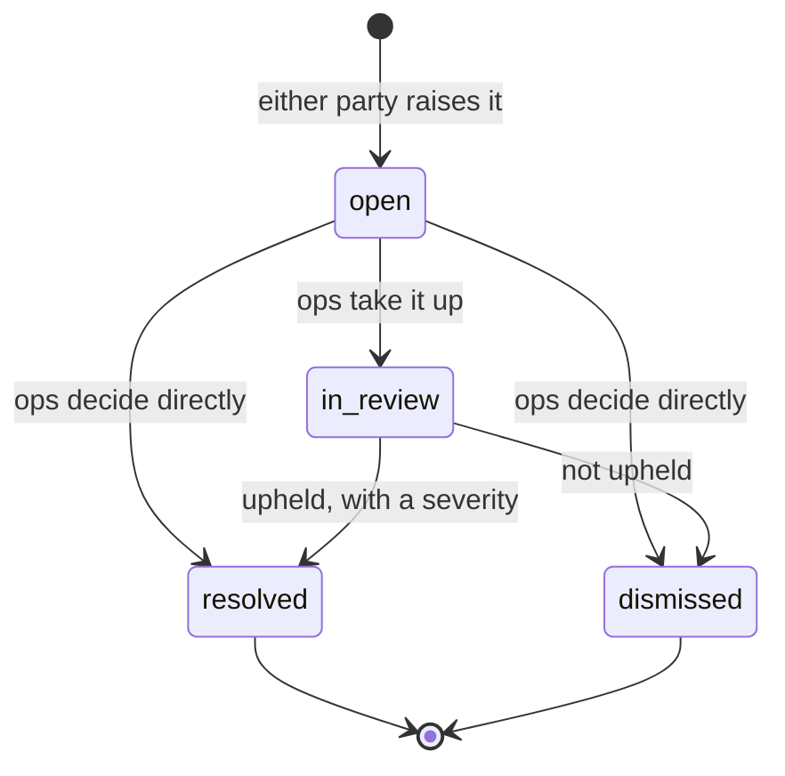

# Trust

Phase 9. Reviews, complaints, the trust score, badge bands and suspension.

Related notes: [verification.md](./verification.md) (who a technician _is_),
[search.md](./search.md) (where the score is used), [bookings.md](./bookings.md),
[money.md](./money.md).

---

## The principle: the score must be explainable

A technician is going to ask ops **"why is my score 62?"** — in Hindi, on the
phone, probably annoyed, about their own livelihood. The only acceptable answer
is a component-by-component one:

> _Your ratings are worth 24 of a possible 35. Your acceptance rate is 18 of 20.
> One complaint was upheld against you, and that cost you 10._

Everything in this document follows from that requirement:

- `computeTrustScore` is **pure** — same inputs, same answer, always.
- Every component reports its **raw value, normalised value, weight and
  contribution**, and all of it is stored on the snapshot.
- Nothing is multiplied by anything undocumented. There is no term nobody can
  explain.
- `GET /api/v1/providers/me/trust` returns the whole breakdown, with i18n'd
  labels, because this becomes a screen in the partner app.

A score somebody cannot argue with is a score they stop believing, and a
marketplace whose supply side does not believe its own ranking has a short life.

---

## What feeds the score

| Component        | Weight | Normalisation                                  | Missing when                    |
| ---------------- | ------ | ---------------------------------------------- | ------------------------------- |
| Customer ratings | 35     | `(decayed avg stars − 1) / 4`                  | Nobody has rated them           |
| Acceptance rate  | 20     | Already 0–1, from Phase 6                      | Below Phase 6's 5-request floor |
| Reliability      | 20     | `settled / (settled + provider cancellations)` | They have accepted nothing      |
| Complaint record | 15     | `1 − weighted load / 6`                        | **Never** — see below           |
| Recent activity  | 10     | `0.5 ^ (days since last paid job / 90)`        | They have finished nothing      |

Weights are config (`TRUST_WEIGHT_*`). Reordering what matters needs **no code
change**, and there is a test that changes the weights and asserts two
technicians swap places.

### The score is rescaled by the weights that applied

```
score = round( Σ(contribution of present components) / Σ(weight of present components) × 100 )
```

Not divided by 100. A technician with three jobs and no ratings yet is scored on
the 65 points that _can_ apply to them, rather than being punished for the 35
that cannot. Same reasoning as the ranking scorer's neutral defaults, arrived at
from the other direction.

### Null, not zero

A technician with no history at all scores **`null`**. Zero would mean "we
measured them and they are untrustworthy", which is a lie about somebody who
started on Tuesday, and it would bury every newcomer under everyone with a
record. The ranking already treats a missing signal as neutral (0.5), which is
exactly right.

The complaints component is the one that is _always_ present — "nothing has been
upheld against this person" is real information, not missing data. But it alone
cannot produce a score, or everybody who had never worked would score 100.

### Decay: old glory fades

Reviews and activity both decay on a **90-day half-life**. A review from nine
months ago is worth an eighth of one from today.

This is not a nicety. Without it, a technician who was excellent last year and
mediocre this month keeps reading as excellent for months — and the customer
booking them today gets the mediocre one. A plain average lets a long good
history absorb a recent collapse; decay does not.

### Complaints are weighted by severity, not counted

| Severity | Weight | Effect on the component (zero at 6) |
| -------- | ------ | ----------------------------------- |
| `minor`  | 1      | −1/6                                |
| `major`  | 3      | −1/2                                |
| `severe` | 6      | **wipes it out**                    |

Deliberately steep at the top. One severe complaint — somebody was unsafe, or
money was taken — should wipe the component on its own, while a handful of minor
ones should not. Averaging would let a pattern of small failures hide behind a
large number of good jobs, and a single serious failure vanish into it.

**A dismissed complaint counts for nothing.** Being accused is not a record; if
it were, the cheapest way to damage a competitor would be to book them once.

---

## Reviews

### Gated on money

A review may only be written for a booking that was **done and paid for** —
either rail. Not "completed": _paid_.

That single rule removes the entire class of fake reviews that costs marketplaces
their credibility. To leave one you must have booked a real technician, had them
turn up, and parted with real money. It also stops a customer who never paid from
using a one-star review as leverage.

The window is `REVIEW_WINDOW_DAYS` (7) from settlement. Long enough that somebody
who was away can still say something; short enough that the memory is real.

One review per side per booking, enforced by a unique index.

### Asymmetric visibility

|                        | customer → provider | provider → customer |
| ---------------------- | ------------------- | ------------------- |
| Public profile         | **yes**             | never               |
| Search card rating     | **yes**             | never               |
| Feeds the trust score  | **yes**             | no                  |
| Visible to ops         | yes                 | yes                 |
| Visible to the subject | yes                 | **no**              |

A technician needs somewhere to record _"this address was not safe to enter"_
without starting a public argument with somebody who can rate them back. The data
is collected and read by ops; nothing scores it, because customer-side trust is
not a thing this version does.

The public endpoint filters on **direction and status in the query**, not after
it, so there is no code path by which an internal review reaches a response. A
test asserts it explicitly — including that the text does not appear anywhere in
the serialised body.

### Names

A public review shows **"Priya S."** — first name and an initial. A full name is
a real safety problem for somebody who has had a stranger in their home; an
anonymous score reads as fake. This is the compromise every marketplace lands on,
for good reason.

### Moderation

Reviews are append-only except for `status`. Ops can hide one; nobody can edit
what it says, including the author. Editing after the fact would make every
_other_ review unreliable, because a reader could no longer tell which had been
touched.

**Hidden reviews are excluded from every aggregate**, because the recompute
simply does not select them — there is no separate "subtract from the average"
step to get wrong. The row survives: deleting the evidence of a moderation
decision is its own kind of dishonesty, and a technician disputing one needs it
to exist.

---

## Complaints

Raised by either party, from **ARRIVED onwards**. Before the technician is at the
door a grievance is a cancellation — calling it a complaint would put a dispute on
somebody's record for a job that never started.

Window: `COMPLAINT_WINDOW_DAYS` (14) from the booking ending.



**Only ops move a complaint.** The person who raised it cannot mark it resolved,
and the person it is against certainly cannot dismiss it. A dispute nobody
neutral looks at is not a dispute process, it is a suggestion box.

Resolving requires a **note and a severity**, both mandatory at the database
level. A decision nobody can review is not a decision, and the severity is what
the engine acts on — leaving it to a default would turn an ops shortcut into a
technician's suspension.

Every transition appends to `booking_events` as well as to `complaints`, so a
dispute read six months later is one query: what was booked, what happened, what
went wrong, what was decided.

### Safety does not wait

A `safety` complaint from a customer suspends the technician **synchronously**,
inside the request, before the response is written.

Everything else in this system is eventually consistent through the outbox, which
is exactly right for money and exactly wrong here. If somebody says a technician
was unsafe in their home, that technician stops receiving bookings now — not
whenever the dispatcher next runs. Ops review it and lift it if it was unfounded:
a wrongly suspended technician loses a day, and the alternative is somebody else
opening their door to a person we had already been warned about.

---

## Badge bands

| Badge      | Requires                                              |
| ---------- | ----------------------------------------------------- |
| `VERIFIED` | Phase 4's KYC ladder complete. Unchanged.             |
| `SILVER`   | VERIFIED **and** trust ≥ 70 **and** ≥ 10 settled jobs |
| `GOLD`     | VERIFIED **and** trust ≥ 85 **and** ≥ 30 settled jobs |

Thresholds are config (`BADGE_SILVER_*`, `BADGE_GOLD_*`).

**Bands ride on verification and never replace it.** A technician who has not
completed the ladder is `NONE` however good their score, because the badge answers
"do we know who this is" before it answers "how do they behave".

**Both a score and a volume threshold**, so nobody reaches GOLD on two perfect
jobs.

**Downgrades happen.** The band is recomputed from scratch on every snapshot, so
a stale GOLD cannot survive its own data. There is a test.

For search, the gate is unchanged: anything ≥ VERIFIED is searchable. Bands affect
**ranking and display**, not eligibility.

---

## Suspension

An output of the engine, not an ops whim. Every rule is config.

| Rule                | Trigger                              | Reason code                |
| ------------------- | ------------------------------------ | -------------------------- |
| Severe complaint    | any complaint resolved `severe`      | `complaint_severe`         |
| Repeat cancellation | ≥ 3 provider cancellations in 7 days | `auto_repeat_cancellation` |
| Low trust           | score < 30 with ≥ 10 settled jobs    | `auto_low_trust`           |
| Safety              | a `safety` complaint, synchronously  | `safety_pending_review`    |
| Ops                 | a person decided                     | `ops_manual`               |

The most serious applicable cause is reported, so a technician with a severe
complaint _and_ a low score is told about the complaint. Every reason has an
i18n key — a technician is entitled to know the exact line they crossed.

Nothing here can fire on somebody with no history: every rule needs either enough
jobs or an upheld complaint.

### Suspension is a separate axis from verification

`provider_profiles.suspended_until` is its own column and **never touches the
badge**. The badge says who they are and the ladder that proved it; suspension
says how they have behaved lately. A technician who serves a suspension must not
have to re-upload their Aadhaar.

### Expiry is lazy, on purpose

The search predicate reads `suspended_until IS NULL OR suspended_until <= now()`.
No job clears the column.

A suspension therefore ends the _moment_ it ends. There is nothing to schedule,
nothing to miss, and no window in which somebody stays unlisted because a cron
did not run. The column keeps its value as a record of what happened.

Category counts share the same predicate, but sit behind Phase 5's five-minute
Redis cache — so a freshly suspended technician lingers in a count for a few
minutes. Accepted: the count is a browsing hint, not a promise, and the search
itself is always correct.

---

## The engine

An outbox consumer, subscribed to everything that could change how a technician
looks:

```
booking.accepted / rejected / expired / cancelled_by_provider
payment.captured / cash_recorded
review.created / review.hidden
complaint.resolved
```

Every trigger does the same thing: **read the current truth from the tables,
score it, write a snapshot.** Never "add one to a counter", never "adjust by the
delta in this event".

### Why that buys idempotency for free

Our outbox is at-least-once, so every handler will be called twice eventually. A
recompute called twice produces the same number twice. An increment called twice
is simply wrong, and nobody finds out for months.

There is a test that replays `review.created` three times and asserts the
aggregates are byte-identical while the snapshot count grows — because each
recompute _is_ a real event worth recording, even when the answer did not change.

### What a recompute writes

1. `provider_stats` — ratings, tag counts, settled jobs, complaint counts, score.
2. `trust_score_snapshots` — the score with its full component breakdown.
3. `provider_verification_summaries.badge` — the recomputed band.
4. `provider_profiles.suspended_until` — if a rule fired, plus a
   `provider.suspended` outbox event.

All in one transaction, so a technician can never be left with a new score and an
old badge.

Snapshots are append-only with a DPDP purge escape hatch, like `booking_events`
— unlike ledger rows, a snapshot _is_ about a person.

---

## How to tune the weights safely

Post-pilot, somebody will want to change these. A short procedure:

1. **Change one weight at a time.** Five interacting knobs turned together
   produce a ranking nobody can explain, which defeats the entire point.
2. **Recompute before you look.** Scores only change when an event arrives, so
   until you run `POST /api/v1/admin/trust/:providerId/recompute` (or the next
   booking lands) the old numbers persist. Compare like with like.
3. **Check the bottom of the list, not the top.** Good technicians score well
   under almost any weighting. What a change actually does is decide who is
   suspended and who never gets a first job.
4. **Never tune the suspension thresholds and the weights in the same change.**
   If suspensions spike you will not know which did it.
5. **The snapshots are your audit trail.** Every score ever computed is still
   there with its components; a bad change is visible in the trend, not just in
   the aggregate.

Weights are read from config on every recompute, so a change takes effect without
a deploy — which is the point, and also the risk.

---

## What is deliberately not here

- **Review replies or appeals.** Ops tooling at most, Phase 11.
- **Any ML or sentiment analysis.** A number a technician cannot check is a
  number they cannot argue with.
- **Customer-side trust scores.** Provider→customer data is collected, not
  scored. Scoring customers is a decision with real consequences and no pilot
  need.
- **Warranty claims.** Complaints cover disputes for now; post-pilot.
- **Notification of any of this.** Phase 10 consumes the topics — including
  `provider.suspended`, which somebody definitely needs to be told about.
- **Public web profile pages.** Phase 12+.
- **Photo or video attachments on reviews.** Deferred.
