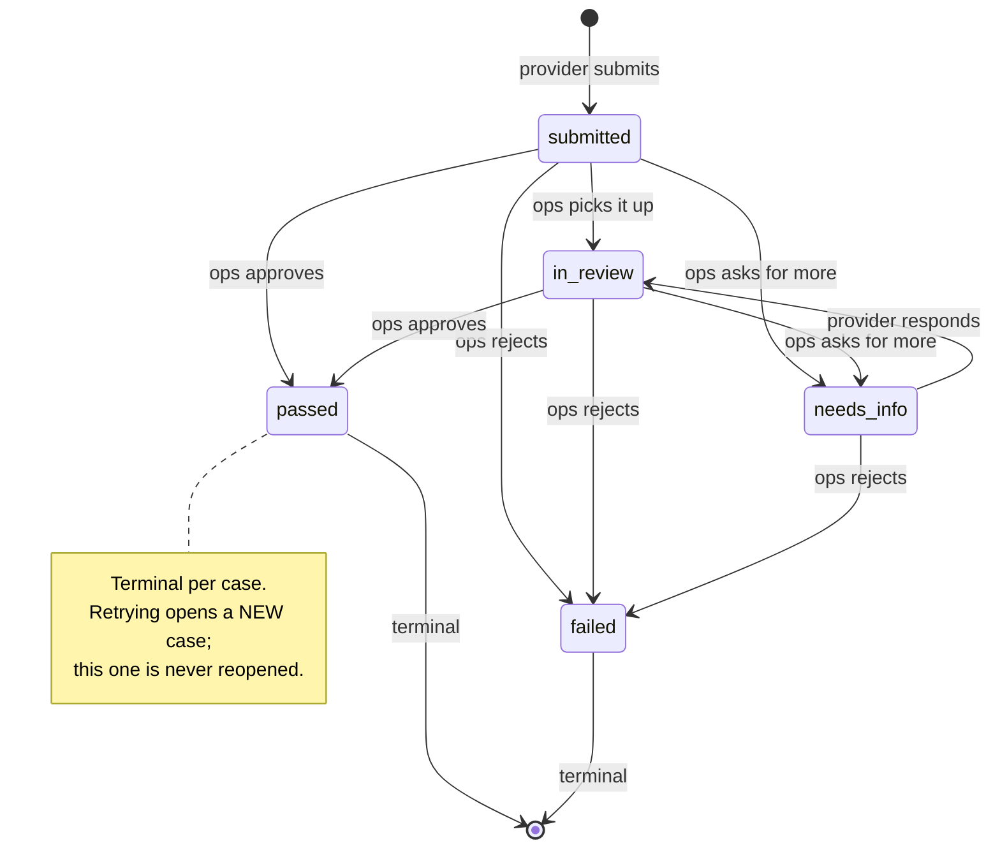

# Verification

Written in Phase 4. Everything geospatial is in [geo-notes.md](geo-notes.md);
this is the trust half of the product.

---

## The sentence that drives the design

> **"Why did this technician have a badge on the day of the incident?"**

If that question cannot be answered — precisely, months later, from data rather
than memory — then "verified" is marketing rather than a promise. Every decision
below follows from being able to answer it.

That single requirement rules out the obvious design. You cannot store a
technician's verification as a `status` column that gets UPDATEd, because the
previous value is gone and with it the answer. So:

**The event log is the truth. Everything else is a cache of it.**

---

## The ladder

Four levels, each independent. A technician may work on 0 and 2 at the same time;
nothing forces an order. The pressure to finish comes from the badge, which needs
all four.

| Level | Name       | Submitted evidence                                       |
| ----- | ---------- | -------------------------------------------------------- |
| 0     | identity   | ID document + selfie + ID type + **last 4 digits only**  |
| 1     | background | Explicit consent (the check itself is ops/adapter work)  |
| 2     | skill      | A certificate, **or** a trade test, **or** a field audit |
| 3     | references | Exactly 2: name, phone, relationship                     |

Passing all four earns the badge `VERIFIED`. `SILVER` and `GOLD` exist in the
enum but are trust-score bands computed in Phase 9 from ratings and job history —
nothing in Phase 4 can award them.

---

## The state machine

A case is one attempt at one level.



`adapter_result_received` is not on the diagram because it moves nothing. A
third-party answer is **evidence**, recorded against the case, and a human still
decides. It is legal in any non-terminal state.

### Why failure opens a new case

A failed case stays failed forever. A re-check is a fresh case with its own
event log, which means the record of the earlier failure and its reasoning is
still there. If a case could be reopened, "it passed" would overwrite "it failed
in March, and here is why" — precisely the history an incident review needs.

---

## Append-only, enforced by the database

`verification_events` is protected by a trigger, not by convention:

```sql
CREATE TRIGGER verification_events_no_update
  BEFORE UPDATE ON "verification_events"
  FOR EACH ROW EXECUTE FUNCTION verification_events_append_only();
```

- **UPDATE is refused unconditionally.** There is no flag, no bypass, no
  privileged path. History is never rewritten.
- **DELETE is refused too**, _except_ when a session sets
  `fixbridge.allow_kyc_purge = 'on'`.

That exemption exists because erasure has to be possible: DPDP gives a person the
right to have their data deleted, and the `ON DELETE CASCADE` from `users` would
otherwise be permanently blocked. It is deliberately awkward — a transaction-scoped
`SET LOCAL` inside one repository function, `purgeVerificationData` — so that
deleting KYC history is always a decision and never a side effect.

Tests assert all three behaviours, including that UPDATE stays refused even with
the purge flag set.

### Status is a projection

`verification_cases.status` is a cached fold of the case's events, kept because
querying "everything in needs_info" against a log is miserable. It is recomputed
from the events on **every** write, and a test asserts

```
stored status == projectStatus(events)
```

for the whole seeded dataset as well as for a live case walked through a
needs-info detour. `projectStatus` **throws** on a log it cannot replay: if that
ever fires on real data, something wrote around the state machine, and failing
loudly beats guessing.

---

## Documents and object storage

The API never touches file bytes.

```
client                     API                      object storage (MinIO/S3)
  │  POST upload-url        │                                │
  │───────────────────────► │  signs a PUT, records intent   │
  │ ◄─────────────────────  │                                │
  │  PUT the file ──────────┼───────────────────────────────►│
  │  POST confirm           │                                │
  │───────────────────────► │  HEAD: does it exist? size?    │
  │                         │───────────────────────────────►│
  │ ◄─────────────────────  │  status: uploaded              │
```

Why it is shaped this way:

- **KYC images never enter our process.** Not in memory, not in a request log,
  not in a heap dump, not on our bandwidth bill.
- **Confirmation is verified, not trusted.** A client saying "uploaded!" proves
  nothing, so the API does a `HEAD` and records the object's real size.
- **The size limit is signed, not promised.** `ContentType` _and_
  `ContentLength` go into the signature, so storage itself rejects a body of a
  different size or type.

> **A pre-signed PUT cannot express "at most N bytes."** Only a pre-signed POST
> policy has `content-length-range`. Signing the exact declared length gets the
> same guarantee with a simpler client, which is why the upload request must
> state its size up front. `HEAD` at confirmation is the second line of defence.

Keys are `kyc/{providerId}/{docType}/{uuid}` — provider first, so everything
about one person shares a prefix and a DPDP erasure request is a prefix delete.

All URLs expire in 5 minutes (`STORAGE_UPLOAD_URL_TTL_SECONDS`,
`STORAGE_DOWNLOAD_URL_TTL_SECONDS`). A test fetches an expired URL and asserts
storage returns 403.

---

## Never store an identity number

**Aadhaar must not exist in our systems.** Not in a column, not in a log line,
not in a fixture somebody pasted from a real card while testing.

Three layers:

1. **The API only accepts the last 4 digits.** `idLast4` is `^\d{4}$`. The full
   number is never transmitted, so it cannot be logged, captured by an error
   reporter, or found in a backup.
2. **A pre-parse guard** rejects any field that looks like a full identity
   number, so a client sending one gets a clear error rather than a confusing
   validation message.
3. **A repository-wide scan runs in CI** — `no-raw-id-numbers.test.ts` walks
   every `.ts`, `.json`, `.sql`, `.md` and `.prisma` file looking for 12-digit
   runs and 4-4-4 groupings. If someone commits a real number, the build fails.

The document _image_ will of course show the number. That is unavoidable, which
is why images live in a private bucket behind 5-minute signed URLs and are never
parsed, OCR'd or copied.

### What the guard deliberately ignores

- **Indian phone numbers** are 12 digits with the country code. Excluded by
  prefix.
- **UUIDs** contain both a 12-digit run and a 4-4-4 group when they happen to be
  all-numeric. They are blanked before scanning.

Both exclusions cost a little strictness and buy a test people will not learn to
ignore. A scan that cries wolf gets suppressed, and then it protects nothing.

---

## Ops accountability

Reviewing KYC material is itself an act worth recording, so:

- **Every decision** writes a `verification_events` row naming the reviewer.
- **Every document view** writes a `kyc_access_logs` row naming the reviewer and
  the exact documents whose signed URLs were issued.

Access logs are a **separate table** from the case timeline on purpose. A read is
not a state transition, and mixing the two would bury the handful of rows an
incident review actually needs under a pile of "someone looked at this".

`fail` and `request_info` require notes. Refusing someone, or sending them back
for more, must be explainable to them later and to a regulator eventually.
Approving needs no justification — the evidence is the justification.

Ops notes are **internal**. A provider sees that a decision happened and what
kind; they never see the reviewer's reasoning. Reference phone numbers work the
other way: ops sees them in full because they have to ring them, and the
provider's own view masks them, so the submission log cannot be mined for a third
party's number.

---

## Badge and listing are independent axes

|             | Decides                  | Owned by                       |
| ----------- | ------------------------ | ------------------------------ |
| `is_listed` | Can they be **found**?   | Profile completeness (Phase 3) |
| `badge`     | Can they be **trusted**? | Verification (Phase 4)         |

Passing levels does not bypass completeness, and completing a profile does not
earn a badge. Phase 5 search will require **both**: `is_listed = true AND badge >=
VERIFIED`.

The seeded data reflects that: 17 listed, of which only 12 are VERIFIED.

### The badge is derived, never accumulated

```ts
computeBadge(currentlyPassedLevels); // all four → VERIFIED, else NONE
```

`currentlyPassedLevels` reads the _latest closed case per level_. So when a
re-check of level 1 fails, level 1 stops being passed, and the badge recomputes
to `NONE` on its own. There is no separate "revoke the badge" code path that
could be forgotten, and no way for the badge to disagree with the cases behind
it. A test walks exactly that: earn VERIFIED, fail a level-1 re-check, watch it
drop — while the original passed case stays untouched.

`badge_since` marks when the current badge was _earned_. It survives
recomputation while the badge holds, clears when it is lost, and starts fresh if
it is re-earned — which is the honest answer to "how long have they been
verified?".

---

## Adapters: wiring a real KYC vendor later

Phase 4 is manual-first. Ops humans make every decision. But the seams are cut
now:

```ts
interface KycAdapter {
  initiate(caseRef: string, payload: unknown): Promise<{ referenceToken: string }>;
  handleResult(result: AdapterResult): Promise<AdapterResult>;
}
```

Two implementations exist: `ManualAdapter` (mints a reference and does nothing —
the default) and `FakeAdapter` (auto-resolves on a later tick, used by tests to
prove the asynchronous path works end to end).

**The interface is asynchronous on purpose.** Real KYC APIs answer by webhook,
minutes or hours later. Designing for a synchronous call and retrofitting the
callback is the expensive mistake, so `adapter_result_received` exists as an
event type from day one even though nothing emits it in production yet.

### To wire Surepass / OnGrid / DigiLocker

1. Implement `KycAdapter` against the vendor's API.
2. Store **only the `referenceToken`** in the event payload — never the identity
   data the vendor saw. The token is the pointer that lets a dispute be traced
   without us holding the underlying data.
3. Add a webhook endpoint that resolves the token to a case and calls
   `recordAdapterResult`.
4. Swap the adapter in `createContext`. Nothing else changes: the service layer
   already talks only to the interface.

A vendor result stays **evidence**. Whether it should auto-decide a case is a
policy question for when there is real volume, and it should be a deliberate
choice rather than something that arrives by accident with the integration.

---

## What is deliberately not here

- Real vendor API calls (interfaces only).
- Trust score, `SILVER`, `GOLD`, auto-suspension — Phase 9.
- Admin UI — Phase 11. These are APIs.
- **Virus scanning of uploads** — noted for Phase 14. Today a technician can
  upload any 10 MB file of an allowed content type and ops will open it. Worth
  fixing before the volume gets interesting.
- Document OCR. Nothing reads the images; a human does.
- Reference-calling tooling. Ops ring the numbers and record the outcome through
  the decide endpoint.
